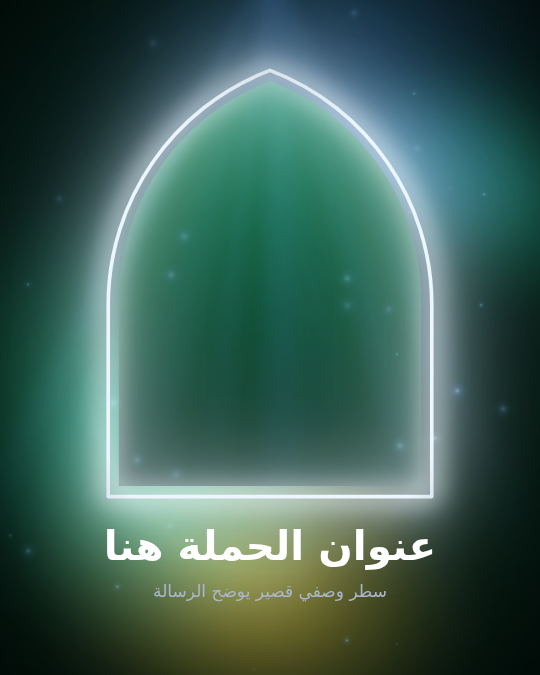
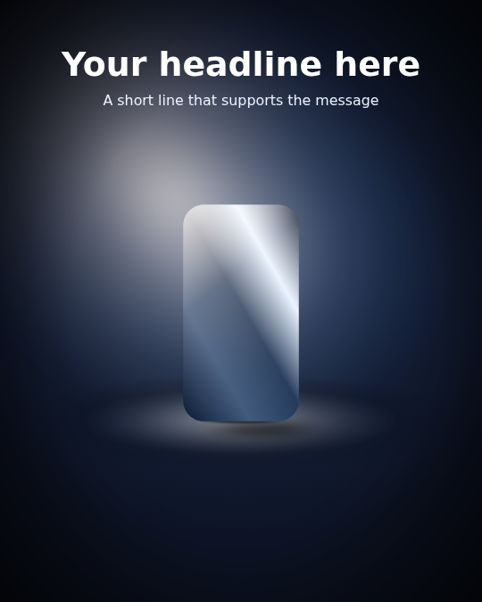
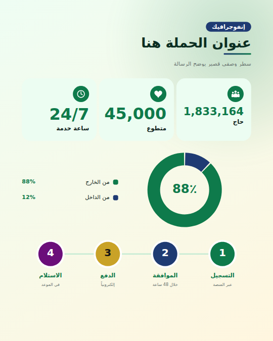
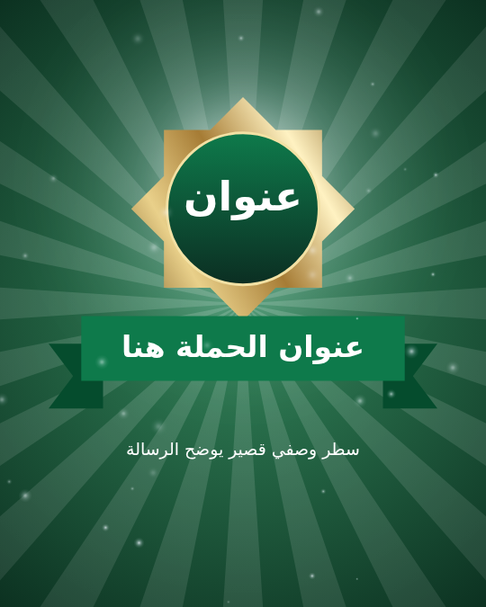

# Artboard Forge

A design-assistant panel for Adobe Illustrator for social-media, campaign, poster,
product and infographic work, with first-class Arabic/RTL support. It builds the
technical *and* the atmospheric parts of a composition — grids, spacing, layers,
**light, shadows, colour, shapes and infographics** — as ordinary, editable
Illustrator art, and leaves the creative decisions to the designer.

> **Status: version 0.2 (creative toolkit).** 202 automated tests pass against a
> simulated Illustrator that runs the real host script. **It has not been run in real
> Illustrator yet** (it was built where Illustrator is not available). Run the
> generated self-test first ([docs/TESTING.md](docs/TESTING.md)): it now also checks the
> new lighting, shadow, shape, text and colour APIs and exports a render for review.

<p align="center">
  
  
  
  
</p>
<p align="center"><sub>Simulator renders (approximate), not Illustrator screenshots. Each is one click from the <b>Create</b> tab and fully editable.</sub></p>

## What it does

| Tab | Features |
|---|---|
| **Create** | **Design recipes** — complete, editable starting compositions in one undo step: *Campaign hero* (glowing arch frame, aurora, rays, headline), *Product spotlight* (stage, key light, rim, floor glow, studio shadow), *Infographic poster*, *Celebration post*, *Quote card*. **Shapes** — ~30 parametric shapes (round/pointed/ogee arches, arch frames, frames, crenellation, 8-point star, bursts, seals, ribbons, tags, tickets, speech bubbles, arrows, chevrons, waves, Sadu-inspired bands, rays, blobs) as clean Bézier paths, styled from your palette (brand gradient, deep, glow, duotone, **foil**, fade, **glass**, outline, **neon**) with optional native drop shadow / glow |
| **Light & Blend** | One **scene light** (compass direction, height, Kelvin warmth or custom colour, intensity, softness) drives everything. **Effects:** back glow, rim light (follows vector outlines), floor glow, neon glow, god rays, key light, light leak, bokeh, haze, vignette and **colour grades** (golden hour, teal & orange, emerald, night, desert, cinematic, luxury) — gradient shapes with Screen / Soft Light / Multiply and optional Gaussian Blur. **One-click scenes:** Hero glow, Golden rays, Studio product, Night neon, Lantern warmth, Emerald luxury |
| **Shadow Studio** | **Studio ground** (contact + core + ambient), **cast** shadows thrown by the light (long at sunset, short at noon), **true silhouette** (your vector art or live text projected onto the floor), contact line, **floating** (UI card elevation or hovering product), **long** flat shadows. Subject types (person, product, bottle, car…), 13 presets, live preview, **edit existing** (even after reopening) |
| **Colour** | **Extract a brand palette from a selected vector logo** (area-weighted, perceptual clustering), harmonies, gradient & fill styles applied to the selection, **swatch groups**, generated **backgrounds** (aurora, spotlight, sunburst, brand gradient, duotone, soft) and **fades** (fade a photo into the background, legibility fades) |
| **Infographic** | Paste `label | value | note` lines and get editable blocks: **stat cards, bar & column charts, donut & pie, progress bars & rings, process steps, timelines, comparison (butterfly), pictograms, icon lists, title headers** — right-to-left layout for Arabic, **Arabic-Indic digits**, World-Ready composer, built-in pictograms, palette colours |
| **Grid & Guides** | Columns, rows, modular, baseline, thirds, golden sections, centre axes, diagonals, radial and custom ratios; targets artboard / all / selection / each object / clip bounds; guides, offsets, safe areas; manage plugin guides only |
| **Spacing & Align** | Live gap read-out with suggestions (4/8/10/12 px or tokens); normalize, distribute, match, exact gap; RTL-aware; linked shadows move with their subject |
| **Layers** | Templates (*Campaign Standard*, *Saudi Campaign Workspace*, *Depth Stack*, custom JSON), Arabic/English layer recognition, rule-based sorting with confidence and preview; never deletes layers |
| **Home & workflow** | Artboards (Instagram, X, LinkedIn, YouTube, 16:9, A4/A3, carousels), *Set Up Design*, context actions for the selection, command palette (Ctrl/Cmd+K), favourites, history, repeat last, presets (import/export), Safe Mode, friendly errors, **one Undo per command**, offline, no telemetry |

More simulator renders: [shadow styles](docs/images/v2-shadow-styles.png) ·
[lighting scene](docs/images/v2-lighting-scene.png) ·
[Arabic infographic blocks](docs/images/v2-infographic-blocks.png) ·
[another brand palette](docs/images/v2-b-campaign-hero.png) ·
[English infographic](docs/images/v2-b-infographic-poster.png) ·
panel: [Create](docs/images/v2-panel-create-built.png),
[Light](docs/images/v2-panel-light-built.png),
[Shadow](docs/images/v2-panel-shadow-preview.png),
[Colour](docs/images/v2-panel-color-extracted.png),
[Infographic](docs/images/v2-panel-info-built.png).

## Quick start

```bash
npm install
npm run verify        # typecheck, build, ES3 check, 202 tests
npm run dev           # simulator at http://localhost:8123/ (real panel + real host script on a mock document)
```

To install in Illustrator, see [docs/INSTALL.md](docs/INSTALL.md). You need Illustrator
2021 (25.3) or later.

## Documentation

| Document | Contents |
|---|---|
| [ARCHITECTURE.md](docs/ARCHITECTURE.md) | Platform research, layers, folder structure, protocol, adapters, command system, tagging, preview, performance |
| [COMPATIBILITY.md](docs/COMPATIBILITY.md) | Supported versions, feasibility matrix (DOM / undocumented / C++), verified API facts with sources, limitations analysis |
| [DATA_MODEL.md](docs/DATA_MODEL.md) | Presets, file format, protocol, tags, settings, storage |
| [UI.md](docs/UI.md) | Wireframe, tabs, design system, keyboard, RTL |
| [ROADMAP.md](docs/ROADMAP.md) | MVP backlog with status, milestones, Phase 2/3 |
| [DEVELOPMENT.md](docs/DEVELOPMENT.md) | Dev environment, scripts, simulator, debugging, ES3 rules, adding commands and ops |
| [INSTALL.md](docs/INSTALL.md) | Build, install (dev and signed), F-key shortcuts, data location |
| [TESTING.md](docs/TESTING.md) | Test layers, in-Illustrator self-test and benchmark, manual QA, sample document workflow |
| [BENCHMARK.md](docs/BENCHMARK.md) | 50 / 500 / 5,000 objects |
| [LIMITATIONS.md](docs/LIMITATIONS.md) | Known limitations |
| [UXP_MIGRATION.md](docs/UXP_MIGRATION.md) | Plan for Illustrator UXP |
| [presets/examples](presets/examples) | Example preset files |

## Principles

- Non-destructive: generated art is new, tagged and named (on role layers such as
  LIGHTING, BACKGROUND, DECORATIONS); deletions are limited to plugin-tagged items.
  The creative commands only add art, except *Apply Colour Style*, which recolours the
  selected artwork (one Undo).
- Selection-scoped: nothing outside the selection is changed.
- One Undo per command.
- Arabic text is never reversed or outlined; generated Arabic text is live, RTL, and
  uses the World-Ready composer.
- Everything stays editable: gradients, blend modes, live effects, live text.
- Nothing leaves the computer.
