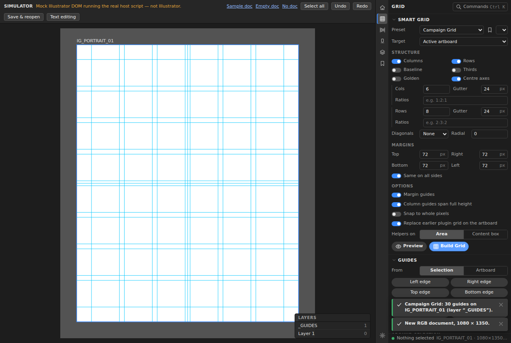
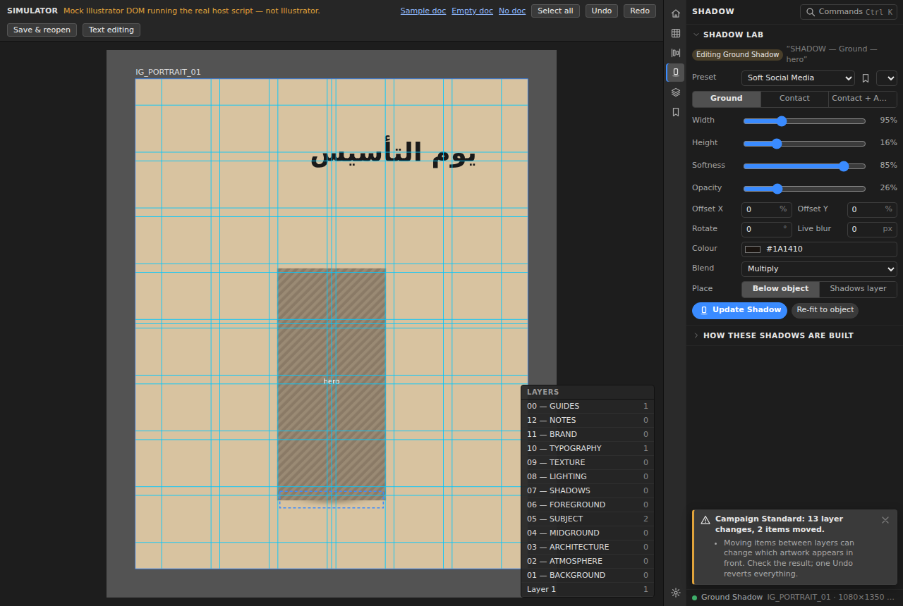
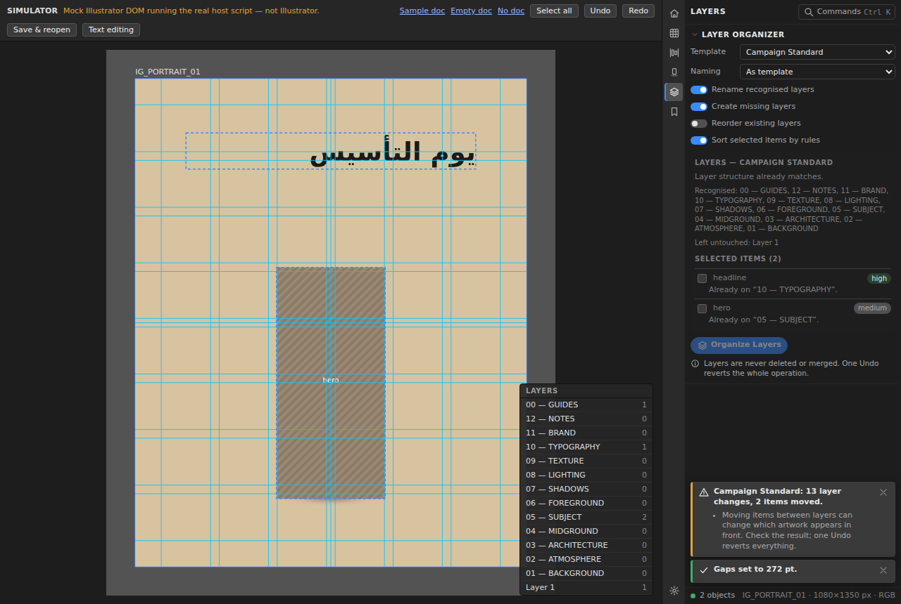
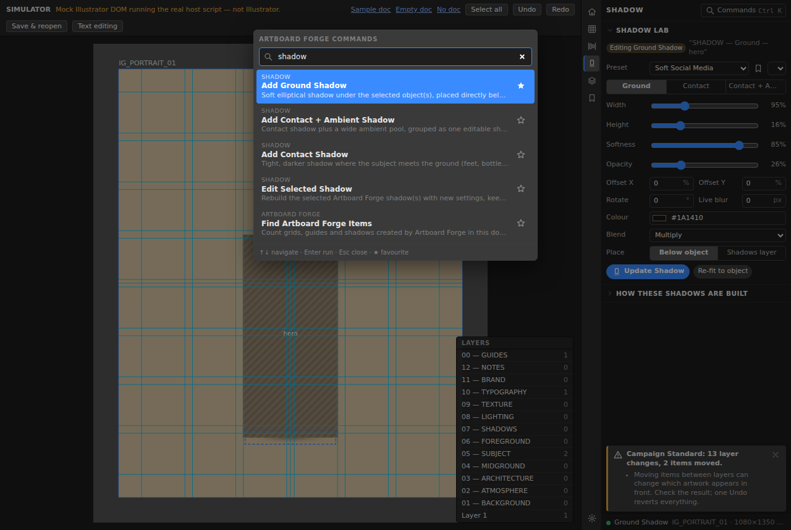

# Panel UI

One dockable panel (320 px default, 220 px minimum). It has an icon rail, a header, a
scrolling content area of collapsible sections, and a status bar. It is dark by default
and follows Illustrator's UI brightness.

## Wireframe

```
┌────┬───────────────────────────────────────────────┐
│ ⌂  │ HOME            [◉ Preview ×]  [🔍 Commands ⌘K]│  ← header: title · preview chip · palette
│ ▦  ├───────────────────────────────────────────────┤
│ ⫴  │ ▾ DOCUMENT                                 🔍 │
│ ▯  │   Founding-Day-Campaign.ai •                  │
│ ◈  │   Artboard     IG_PORTRAIT_01 (1/2)           │
│ ▭  │   Size         1080 px × 1350 px              │
│    │   Colour RGB · Layers 14 · Host Illustrator 29│
│    │   ARTBOARD FORGE ITEMS  [Grid: 1] [Shadow: 2] │
│    │ ▾ FOR THIS SELECTION                          │
│    │   Linked image “hero”                         │
│    │   [Add Ground Shadow] [Contact + Ambient]     │
│    │   [Build Grid from Selection] [Organize…]     │
│    │ ▾ QUICK ACTIONS (★ in palette)                │
│    │ ▾ ARTBOARDS   Size [IG Portrait ▾] Mode [Auto]│
│    │   [Create / Switch]  Carousel: Slides 5 Gap 0 │
│    │ ▾ SET UP DESIGN  Recipe [Saudi Campaign ▾] [▶]│
│ ⚙  │ ▾ RECENT                                   ⇄  │
├────┴───────────────────────────────────────────────┤
│ ● Linked image “hero”        IG_PORTRAIT_01 · 1080×1350 · RGB │ ← status bar
└────────────────────────────────────────────────────┘
```

| Rail | Tab | Sections |
|---|---|---|
| ⌂ | **Home** | Document (+ recognised plugin items, preview-leftover cleanup) · For this selection (context actions) · Quick actions (favourites) · Artboards (social sizes, carousel, auto-number) · Set up design (recipes) · Recent (history, repeat) |
| ▦ | **Grid & Guides** | Smart Grid (preset bar, target, structure toggles, columns/rows/ratios, baseline, diagonals, radial, margins, options, Preview / Build) · Guides (edges, centres, thirds, quarters, golden; offsets +8/+16/+24/+32/custom) · Safe areas · Manage plugin guides |
| ⫴ | **Spacing & Align** | Spacing (live gap read-out, suggested value, system, axis, keep-fixed RTL/LTR, Normalize / Distribute / Match smallest / largest / first, exact gap) · Measure (2 objects, copy values) · Margins to artboard |
| ▯ | **Shadow Lab** | Mode badge (Add / Editing) · preset bar · type (Ground / Contact / Contact + Ambient) · width, height, softness, opacity sliders · offsets, rotation, live blur · colour · blend · ambient pool · placement · Preview / Add / Update / Re-fit |
| ◈ | **Layers** | Template, naming format, options · live plan (creates, renames, moves) · per-item proposals with confidence badges, reasons and checkboxes · Organize |
| ▭ | **Presets** | Kind · list (built-in / mine) · Duplicate, Rename, Edit (validated JSON), Delete · Import / Export |
| ⚙ | **Settings** | Units, density, direction, bounds, defaults, guide layer name, artboard naming, Safe Mode, poll interval · Diagnostics (copy) · Privacy |

The tabs **COMPOSE, DEPTH, COLOR, PATTERN, TYPE, CLEAN, EXPORT** from the brief are
not shown until their modules exist. There are no placeholder buttons.

## Design system (`src/ui/components`)

| Component | Notes |
|---|---|
| `Button`, `IconButton` | primary / secondary / quiet / danger, small, icon-only; pill-shaped like Spectrum |
| `Section` | collapsible, remembers state per panel, optional hint and header actions |
| `NumberField` | **scrub** by dragging the label (Shift ×10, Alt ×0.1), arrow keys, Enter/Esc; length fields accept `5mm`, `24px` and show the current unit |
| `Slider` | range + value read-out; live `onInput`, committed `onChange` |
| `Select` (Dropdown) | option groups |
| `Toggle` | switch with label |
| `Segmented` | exclusive options (unit, axis, placement, RTL/LTR…) |
| `ColorField` | native picker + hex input |
| `TextField`, `SearchBox` | — |
| `PresetBar` (PresetDropdown) | select + Save as new + ⋯ menu (update, duplicate, rename, delete) |
| `ProgressBar` | indeterminate while the host works; determinate API for chunked jobs |
| `Readout`, `Badge`, `Note`, `Empty` | dense read-outs |
| Toasts | success / info / warn / error; *Details* expands technical info; *Copy diagnostics* |
| Dialogs | confirm (lists affected items), prompt |
| Tooltips | native `title` on every control (CEP renders these reliably) |

### Tokens

- **Spacing scale:** 2 · 4 · 6 · 8 · 12 · 16 px (`--s1…--s6`).
- **Field height:** 22 px compact, 26 px comfortable.
- **Colours:** `--bg`, `--bg-field`, `--bg-raised`, `--line`, `--text`, `--text-dim`,
  `--accent`, `--good`, `--warn`, `--danger`, `--af` (plugin items).
- **Light theme:** applied when Illustrator's panel background is light.

## Keyboard (panel focused)

| Keys | Action |
|---|---|
| Ctrl/Cmd + K or `/` | Command palette (↑ ↓ Enter Esc, ★ to favourite) |
| Ctrl/Cmd + Shift + R | Repeat last command |
| Alt + 1…6 | Switch tab |
| Esc | Cancel live preview / close dialog |
| Enter / Esc in dialogs | Confirm / cancel |

Global F-key shortcuts: see [INSTALL.md › Keyboard shortcuts](INSTALL.md#keyboard-shortcuts-f-keys).

## RTL / Arabic

- *Keep fixed: Right (RTL)* is the default. Horizontal spacing keeps the right-most
  object in place.
- Arabic text is only measured and moved, never rewritten, reversed or outlined.
- Snapshots flag Arabic text frames (`text.arabic`) for type tools in Phase 2.

## Screenshots (simulator)

The real panel, driving the real host script on the mock document (`npm run dev`).
These are **not** Illustrator screenshots.

| Grid built from the Campaign Grid preset | Editing a recognised shadow after save and reopen |
|---|---|
|  |  |
| **Layers organised (preview, then applied)** | **Command palette: "shadow"** |
|  |  |
